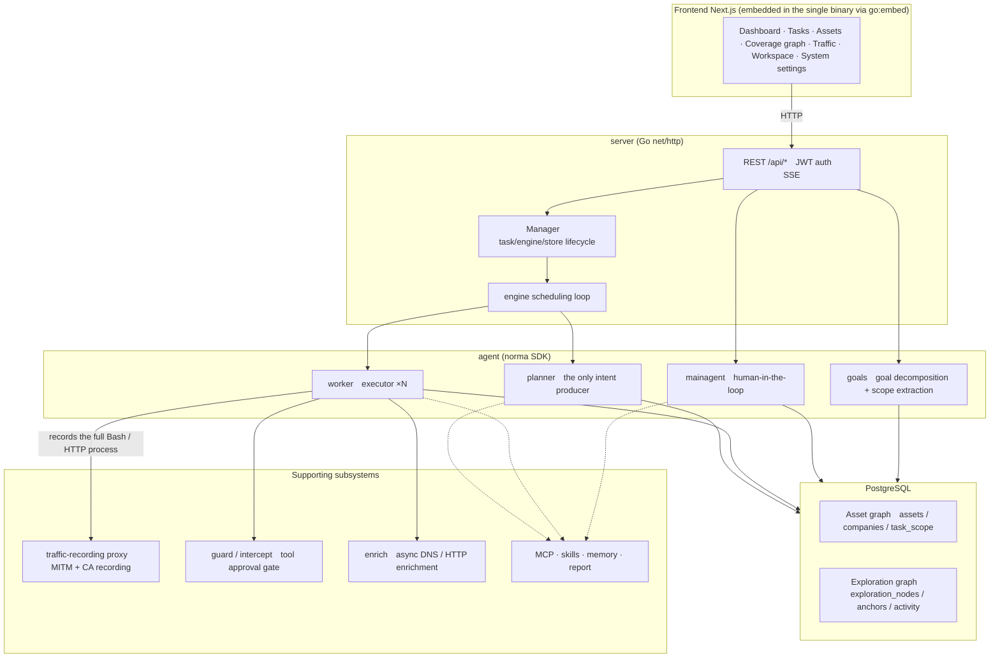
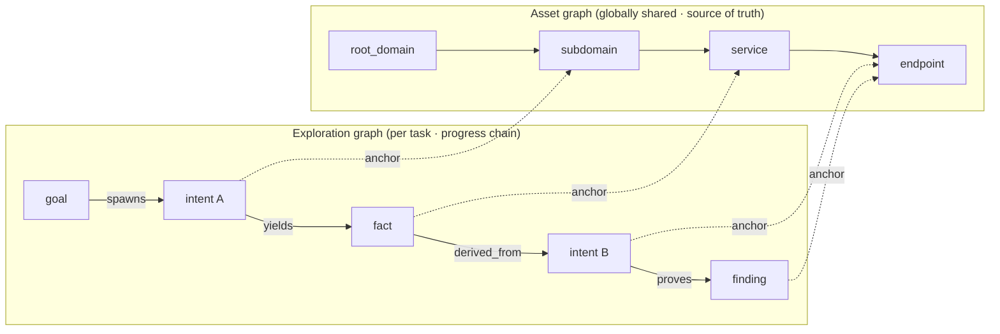
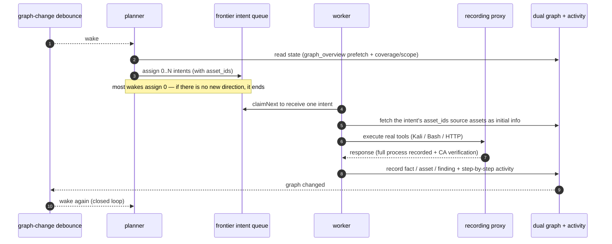
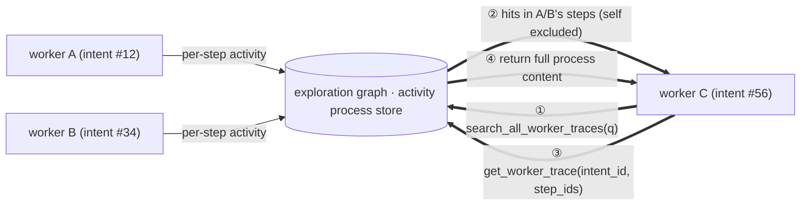
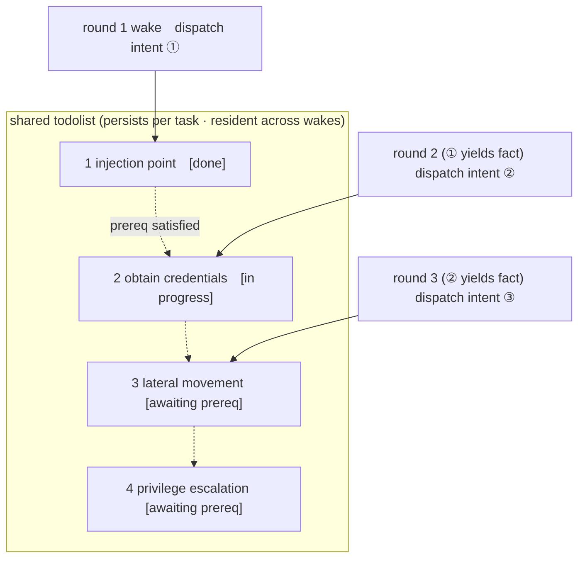

<div align="center">

# ARTEX — Korean Edition

**An autonomous penetration-testing system driven by LLM multi-agents** (Go backend + Next.js frontend)

[한국어](README.md) · [中文](README.zh.md) · English

[](https://github.com/jiwoochris/artex-ko/actions/workflows/ci.yml) [](https://github.com/jiwoochris/artex-ko/actions/workflows/detections.yml) [](https://github.com/jiwoochris/artex-ko/actions/workflows/web.yml) [](LICENSE)

</div>

---

> ## 🚨 Security & misuse warning — read this first
>
> **This repository is published for use only within authorized environments, and only to build defensive and detection capabilities.**
>
> ARTEX is an autonomous offensive tool powerful enough to carry an attack from reconnaissance through intrusion to data exfiltration with little human involvement, so the harm from misuse is correspondingly large. In October 2026, several Korean news outlets reported that investigators had found indications the upstream ARTEX was used in personal-data breaches targeting Korean financial institutions; the related investigation is ongoing. This Korean edition is not published to help attackers. Its purpose is to help defenders understand how such autonomous AI attacks work and build the capability to detect and block them.
>
> - **Unauthorized use is a crime in itself.** Do not run any scanning, probing, or exploitation against systems you do not own or for which you lack explicit written authorization. In the Republic of Korea, unauthorized intrusion into an information and communications network violates the Network Act, and the Personal Information Protection Act also applies where personal data is involved.
> - **Do not target live services or other parties' assets.** Verify only in learning, research, and locally isolated environments you own (deliberately vulnerable targets such as OWASP Juice Shop or DVWA).
> - **Read it from a defender's point of view.** This repository also compiles defensive and detection material, such as detection signatures and hardening checklists, for autonomous AI attacks. → **[Defense & Detection Guide](docs/defense-en.md)** (also in [Korean](docs/defense-ko.md))
>
> If you do not agree to this warning and to the [usage restrictions and disclaimer](#license-and-disclaimer) below, do not download or use this repository.

---

> **This repository is a localized edition of the Chinese open-source project [Autumn-27/ARTEX](https://github.com/Autumn-27/ARTEX) (AGPL-3.0), adapted so that Korean users and teams can adopt it as-is.** To preserve the agents' decision-making performance, the internal reasoning prompts are kept in the original language, and only the user-facing output (findings, summaries, reports, chat replies) is forced into Korean. See ["Why a Korean edition"](#why-a-korean-edition) below for the rationale.

ARTEX is a system in which several LLM-driven agents autonomously run a penetration test: they **break goals down on their own, execute real tools, and accumulate discovered assets and vulnerabilities into a graph** as they go. A single Go binary ships with the Next.js frontend embedded, and all data is stored in PostgreSQL.

> **Note on this edition's language.** The product UI, prompts, and user-facing output of this fork are being localized to **Korean**, not English. This English README exists so international readers can understand what the project is, how it differs from upstream, and how to run it. If you want the agent output in another language, see [Configuration](#configuration) — the output language is enforced by a small code-fixed directive that can be adapted.

---

## ⚠️ Read first — authorized use and legal notice

ARTEX may be used **only against targets you own or for which you have explicit written authorization.** Any scanning, probing, or exploitation beyond the authorized scope may itself be illegal.

- In the Republic of Korea, intruding into or disrupting another party's information and communications network without authorization violates the **Act on Promotion of Information and Communications Network Utilization and Information Protection** (정보통신망법).
- Personal data collected or exposed during a penetration test is subject to the Korean **Personal Information Protection Act** (개인정보보호법). Even with authorization, handle the access, retention, and deletion of personal data with care.
- Wherever you are, comply with your own jurisdiction's laws on network security, data protection, and computer crime.
- Use this for **learning, research, and verification in locally isolated environments.** Before targeting any live external system, secure written authorization and an agreed scope and time window.

Full license terms, usage restrictions, and the disclaimer are in the [License and disclaimer](#license-and-disclaimer) section below. Using this tool constitutes your agreement to those terms.

---

## Why a Korean edition

Upstream ARTEX has its prompts, UI, and documentation entirely in Chinese, which made it cumbersome for Korean users to read the results and share them with a team. This edition aims to:

- **Localize the output** — the findings, fact summaries, final reports, and chat replies that agents surface to a human are forced into Korean. Commands, payloads, code, URLs, and raw logs are needed for analysis and are left in their original form.
- **Preserve performance** — the internal reasoning prompts (the behavioral instruction body) that drive the agents' judgment are **not** translated. Behavior benchmarked in the original language is kept intact, and only the output language is changed, avoiding the quality drift that translation introduces.
- **State the legal boundaries** — the notices on Korean network and privacy law and the "authorized scope only" warning are provided clearly in Korean.
- **Support the local stack** — the LLM provider can be swapped from a frontier model to any OpenAI-compatible endpoint (domestic or open models). See [Configuration](#configuration).

> The boundaries and design policy of this localization are documented in more detail in the repository's working notes. To make it easy to diff against the upstream repository, the original Chinese document is preserved as [`README.zh.md`](README.zh.md).

---

## Screenshots

The three screens below are the localized Korean UI. The data comes from a local, isolated sandbox: every target is the fictional `acme.com` and private address ranges.

<p align="center">
  <br>
  <sub><b>Dashboard</b> — active tasks, confirmed findings, asset nodes, LLM token spend, and the activity feed on one screen.</sub><br>
  <sub>This dashboard image was captured before the card labels were localized, so the data-source name on the "LLM Token 소비" card still reads as the raw identifier <code>llm_usage</code>. The current build shows the localized labels there instead: 「계량 원장」 (new) and 「활동 통계」 (old).</sub>
</p>

<p align="center">
  <br>
  <sub><b>Findings</b> — results aggregated by severity, status, asset, and owning task, exportable to CSV.</sub><br>
  <sub>Finding <b>titles</b> are model-generated, so English technical terms can appear, mirroring the target app ([Model selection and output language](#model-selection-and-output-language)). The description under each title and the rest of the UI are Korean.</sub>
</p>

<p align="center">
  <br>
  <sub><b>Chat</b> — a human steps into the autonomous run to inject hints while the agent summarizes the attack chain in Korean.</sub>
</p>

The original (Chinese UI) screens are available in [`README.zh.md`](README.zh.md#截图预览) (Chinese UI).

---

## Quick start (Docker Compose)

> **Prerequisites:** Docker and Docker Compose. The database is **PostgreSQL**, brought up by compose. Exploration requires an **LLM** (`ANTHROPIC_API_KEY` or `OPENAI_API_KEY`; can also be set in the UI).

Compose builds this repository's Korean UI and Go server inside the image using `Dockerfile.ko`. You do not need Go or Node.js on the host.

```bash
git clone https://github.com/jiwoochris/artex-ko.git
cd artex-ko
cp .env.example .env          # set POSTGRES_PASSWORD; ANTHROPIC_API_KEY is optional
docker compose up -d --build  # builds the Korean image and starts it with PostgreSQL
# → open http://localhost:8787 (on first visit, set the admin password at /setup)
```

The Korean image bundles common tools (ripgrep, curl, vim, npm, nmap, and more). `./skills` and `./data` are bind-mounted to the host and survive container recreation. After updating the source, run `docker compose up -d --build artex` to rebuild the image. The Korean container uses a `ko`-prefixed version, which disables the UI's binary self-update.

### Other installation methods

Upstream provides several methods: an install script (`./install.sh`), precompiled binaries (Releases), and a single-binary build from source. The commands and full procedure are collected in the "安装" (Installation) section of [`README.zh.md`](README.zh.md#安装) (in Chinese); the essentials are reproduced below.

- **Install script:** running `./install.sh` detects/installs Docker and then lets you choose "① all-in-Docker" or "② local compile and run."
- **Single-binary build from source:**

  ```bash
  cd web && npm ci && npm run build:static && cd ..   # 1) static frontend build
  mkdir -p server/webui && cp -r web/out server/webui/dist   # 2) copy into the embed directory
  CGO_ENABLED=0 go build -tags embedui -o artex ./cmd/artex   # 3) compile with the frontend embedded
  ./start.sh                                          # → http://localhost:8787
  ```

> Launch with `start.sh` (`start.bat` on Windows) rather than running `./artex` directly. That script is a supervisor that restarts the program based on its exit code, and it also handles the UI's "one-click update."

---

## Configuration

**Database** (`config.json`, or override with the `ARTEX_PG_DSN` environment variable):

```json
{
  "database": {
    "host": "127.0.0.1", "port": 5432,
    "user": "artex", "password": "yourpass",
    "dbname": "artex", "sslmode": "disable"
  }
}
```

**LLM:** `export ANTHROPIC_API_KEY=sk-...` (or `OPENAI_API_KEY`), or enter it on the UI's "LLM settings" page. Optional environment variables: `ARTEX_LLM_PROVIDER` / `ARTEX_LLM_MODEL` / `ARTEX_LLM_BASE_URL` / `ARTEX_LLM_PROXY`. To use a domestic or open model, point `ARTEX_LLM_BASE_URL` at an OpenAI-compatible endpoint.

**Output language:** this edition forces user-facing output into Korean via a small, code-fixed directive appended to each role's system prompt (it does not translate the reasoning body). If you need a different output language, adapt that directive in `agent/prompt.go` (`langDirective`).

**Concurrency:** the number of worker agents spawned per task is adjustable under "System settings" (default 3).

**Common flags:** `./start.sh -addr :8787 -proxy :8788` — `-addr` is the frontend and API, `-proxy` is the traffic-recording proxy port.

### Model selection and output language

The Korean localization is **driven by a prompt directive (`langDirective()` in `agent/prompt.go`), not a hard-coded cap.** So how consistently the output stays in Korean depends on the model's capability, the role, and the context.

- **Use a capable frontier model.** In a short validation run that applied only the production directive against a local isolated sandbox, the default model `claude-opus-4-8` kept user-facing output in Korean across all four roles — planner, worker, reporter, and an authorized-sandbox planning request — with no refusals. `gpt-4o` also stayed in Korean on the same scenarios. A cheaper, smaller model (for example `gpt-4o-mini`), by contrast, let the report fall back to the original language. Output-language quality tracks model capability directly, so use a capable model wherever a human reads the report.
- **Some role- and context-dependent drift remains.** Divergence shows up in role and output format more than in language itself. In particular, short outputs such as the worker's final one-sentence summary can expose the model's English chain-of-thought verbatim, and the structured fields of `report_finding` can lean toward English, mirroring the target app and its technical terms. In an earlier run, `gpt-4o`'s planner situation summary also reverted to the original language on some turns. Stating "write in Korean" explicitly in the task instruction raises the fidelity.
- **Give reasoning models a generous `max_tokens`.** A reasoning model that uses a separate thinking channel can spend a small response-token budget entirely on internal reasoning and leave the user-facing final answer empty. Here the answer itself disappears rather than the language, so set that LLM profile's `max_tokens` high enough.

> **Token-cap pitfall on the OpenAI-compatible path.** OpenAI-family models such as `gpt-4o` cap response tokens at 16,384. OpenAI-compatible requests, however, carry a larger default output cap (32,768), so leaving it unchanged makes every call fail with `400 (max_tokens is too large)`. In that case, **set that profile's `max_tokens` to 16,384 or lower on the LLM settings page.** Anthropic-family models (including the default `claude-opus-4-8`) allow 32,768 and do not hit this pitfall.

### Reverse-proxy deployment (HTTPS / expose only 443)

The frontend and the API/SSE are both served by the same backend port (default `:8787`), and the live activity stream connects **same-origin** by default. So there is no need to set `NEXT_PUBLIC_SSE_BASE` separately: expose only 443 to the public network and keep 8787 internal.

SSE holds a long-lived connection and keeps pushing events, so you **must disable buffering** in the reverse proxy. If you don't, the browser connects but receives no events (the activity stream appears stuck loading). An Nginx configuration example is in [`README.zh.md`](README.zh.md#反向代理部署https--只开放-443).

---

## System architecture

ARTEX is an **autonomous penetration system driven by LLM multi-agents.** It uses a single Go backend (with the Next.js frontend embedded) over PostgreSQL, and the agent capabilities are provided by the [`norma`](https://github.com/Autumn-27/norma) SDK. At its core is a **dual-graph structure** and the two autonomy mechanisms around it: process-level information exchange between workers, and the planner's multi-round shared todolist.

### Overall layers



- **Frontend** — the Next.js static build is embedded into the single binary with `go:embed`. It visualizes tasks, assets, exploration chains, and the coverage graph, and provides the human-in-the-loop chat.
- **server** — handles `net/http` routing, JWT auth, and SSE; the `Manager` owns the lifecycle of tasks, engines, and the DB store.
- **engine** — per task, runs one `plannerLoop` and N worker goroutines, handling intent assignment, timeouts, pause, and drain.
- **agent** — split into goals / planner / worker / mainagent; the `ToolSet` exposes the dual graph as LLM tools.
- **db** — stores the dual graph in PostgreSQL (pgx); the schema embedded via `go:embed` idempotently creates the tables on every startup.
- **support** — the recording MITM proxy, the approval gate, async enrichment, and MCP / skills / memory / report.

### The dual graph: exploration graph + asset graph

The system separates "what the target is" from "how far it has been tested" into two graphs that are independent yet linked by anchors.

- **Asset graph (globally shared)** — the source-of-truth asset store shared across tasks. Nodes are `root_domain / subdomain / ip / service / app / endpoint` and belong to a company. The parent-child relationships (domain → subdomain → service → endpoint) and the dedup keys are all computed by the program; agents submit only the raw information.
- **Exploration graph (independent per task)** — the "thinking and progress" of a single task. Nodes are `goal / intent / fact / finding / hint`, connected by edges such as `spawns / derived_from / yields / proves` to form lineage chains.
- **The two graphs are linked by anchors** — `exploration_anchors(node_id, asset_id)` pins intents, facts, and findings to concrete assets. This lets you query, from the exploration side, which asset a direction was attacking, and conversely which intent tested a given asset in this task and what facts it produced — in both directions.



> Division of roles: the **planner** reads the state of the exploration graph and judges goals, emitting **intents** to the frontier only when there is a new direction not yet covered. A **worker** takes a **single intent**, executes it with real tools, writes the new assets/facts/findings into both graphs, and then stops. The asset graph is shared truth; the exploration graph is the per-task progress chain.

### The engine and the intent lifecycle (one closed exploration loop)

The engine is an **event-driven** closed loop. When the graph changes it wakes the planner; when the planner emits an intent a worker claims and executes it and writes the results; that write in turn triggers the next round. This cycle continues until a goal is proven (`prove_goal`).



### Process-level information exchange between workers

In deep exploration, valuable observations (a particular error, a response fragment, a hidden parameter) often arise during one worker's **execution process** without being recorded as a formal fact. To avoid duplicated effort and let later workers build on earlier observations, workers can **search the processes of other workers.**

- `search_all_worker_traces(q)` — search the execution processes of other workers in the same task by keyword (the worker's own intent steps are excluded automatically). Hits carry an `intent_id`.
- `list_worker_traces` / `get_worker_trace(intent_id, step_ids=[…])` — first see which workers ran, then pull the full content of specific steps of a given worker to exchange details.

This way, even when there is not yet a corresponding fact in the exploration graph, a later worker reuses observations from another's process. Information flows between workers at the "execution process" level while the boundaries stay intact (each worker still performs only its single assigned intent).



### The planner's multi-round shared todolist → a stable attack chain

A real attack chain is often an ordered sequence of mutually dependent steps (e.g., find an injection point → obtain credentials → lateral movement → privilege escalation), and dispatching them all in parallel at once would tangle them. So the planner holds a **planning todolist that persists per task and is shared across wakes.**

- The planner is event-driven, so it wakes whenever the graph changes, but **each wake is a fresh session.** The shared todolist records the serial attack chain **once** and then, across subsequent rounds, assigns intents **one step at a time in dependency order** (it does not unfold the whole chain ahead of time in a single round).
- Each round, it assigns an intent only to the next step whose prerequisite is done and whose depended-upon fact already exists, updating the list as it goes (marking fact-satisfied steps complete).



This lets the attack chain progress reliably even in an "event-driven + stateless session" environment — without duplication and without going out of order. This is the core of how ARTEX completes multi-step attack chains autonomously.

---

## Defense and detection material

This repository aims to help the **defending side** understand how autonomous AI attacks work and build the capability to detect and block them. It takes the ARTEX behavior seen in the architecture above and turns it around into a **defender's view**, laying out what to observe and where to tighten.

- **[Defense & Detection Guide (docs/defense-en.md)](docs/defense-en.md)** (also in [Korean](docs/defense-ko.md))
  - How autonomous AI attacks differ from traditional scanners, why they are hard to detect, and how to detect them anyway
  - The fingerprints a defender can observe (IoCs and behavioral signatures) — separated into the target view and the forensic view
  - The entry points attackers target and the corresponding hardening (auxiliary authentication, IDOR, credential stuffing, sessions and secrets)
  - WAF/SIEM/authentication-log detection rules (pseudo-rules), a hardening checklist, and an incident-response summary
  - Korean official channels for indicators of compromise and advisories (KISA, FSI, PIPC) and the reporting duties under Korean law
- **[Deployable detection rules (detections/)](detections/)** — the guide's fingerprint detections shipped as ready-to-use rules: the host/log/SIEM layer as [Sigma](https://sigmahq.io) rules (atomic + correlation; use `sigma convert` for Splunk, Elasticsearch, and others), and the network layer as [Suricata](https://suricata.io) rules targeting the enrich prober User-Agent.
  - **[ATT&CK coverage layer (detections/attack/)](detections/attack/)**: a [MITRE ATT&CK Navigator](https://mitre-attack.github.io/attack-navigator/) layer (JSON) that maps the rules above to the techniques they tag, so you can see at a glance which attack behavior each rule catches. Every technique comes only from a rule's `attack.*` tags, with nothing added by guesswork.
  - **[Machine-readable indicator list (detections/indicators/)](detections/indicators/)**: the unique fingerprints ARTEX itself emits, gathered into a single CSV (`artex_indicators.csv`) and shipped as a ready-to-import MISP event (`artex_indicators.misp.json`) as well, so you can drop them straight into a SIEM lookup table or a threat-intelligence platform (MISP, or anything that ingests the MISP format) as indicators of compromise (IoCs). Every value is a string verified in the repository source, and each row carries its source file and detection rule.
  - The rules, the layer, and the indicators above are all re-run and verified by the repository tests ([detections/tests/](detections/tests/)): a detection rule you cannot run is only a claim.

> This material is continually expanded. Suggest additional detection rules or hardening items as issues, and when you send a rule directly, please follow the contract in [the "Contributing detection rules and detection tests" section of the contributing guide](CONTRIBUTING.en.md#contributing-detection-rules-and-detection-tests) (ground every indicator in observable fact, state the limits, pass static validation, and include a reproducible test).

---

## Development

Local development and testing:

```bash
./dev.sh    # backend (:8787) + traffic proxy (:8788) + frontend next dev (:5173) → http://localhost:5173
```

- Backend: `go run ./cmd/artex` (without `-tags embedui` the frontend is not embedded)
- Frontend: `cd web && npm run dev` (proxies `/api` to the backend, with hot reload)
- Tests: `go test ./...`
- Mock preview (no backend): `cd web && NEXT_PUBLIC_MOCK=1 npm run dev`

For other development topics (such as manual vulnerability re-verification), see the "开发" (Development) section of [`README.zh.md`](README.zh.md#开发).

The changes this Korean edition adds on top of upstream ARTEX are tracked in the [changelog (CHANGELOG.en.md)](CHANGELOG.en.md).

---

## License and disclaimer

### Open-source license

This project is distributed under the **GNU Affero General Public License v3.0 (AGPL-3.0)**. The full terms are in the [LICENSE](LICENSE) file at the repository root.

Anyone is free to use, modify, and distribute it, but **derivative works must also be released under AGPL-3.0.** In particular, if you modify this project and **provide it to users over a network (e.g., as an online service), you must make the corresponding complete source code available to those users.** This Korean edition likewise keeps AGPL-3.0.

> ⚠️ **Important:** an open-source license itself does not restrict how the software may be used. The "Usage restrictions" and "Disclaimer" below are an additional covenant and a serious notice that the original author requires of users — please observe them.

### Usage restrictions

- Use this tool to **read and study the source code**, and to **verify its technical principles in a locally isolated environment.**
- Unless the target is one you own or for which you have **explicit written authorization**, do not scan, probe, exploit, or attack any website, online service, or connected system.
- Using it for illegal intrusion, data theft, denial of service (DoS), or any other destructive or criminal activity is strictly prohibited.
- You must comply with all laws on network security, data protection, and computer crime in your country and region (in Korea, the 정보통신망법, 개인정보보호법, and others).

### Disclaimer

This project is provided "AS IS" without any warranty, express or implied. The original author and contributors are not liable for any direct or indirect damage, data loss, system damage, or legal dispute arising from the use of this tool (regardless of whether it was used appropriately). **Downloading, installing, or using this project is deemed to constitute your having read, understood, and agreed to all of the above conditions.**

**All legal responsibility and consequences rest with the user.**

---

## Upstream project

- Upstream repository: [Autumn-27/ARTEX](https://github.com/Autumn-27/ARTEX)
- Original README (Chinese): [README.zh.md](README.zh.md)
- Original online demo (Chinese UI): [https://artex-demo.vercel.app/](https://artex-demo.vercel.app/)
- Agent SDK: [Autumn-27/norma](https://github.com/Autumn-27/norma)
